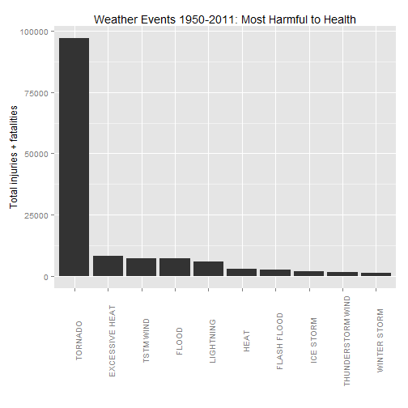
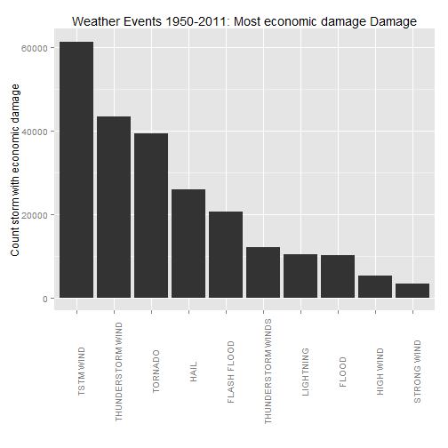

Health and Economic Impacts of Weather Events
========================================================


Synopsis
------------------------
Storms and other severe weather events can cause both public health and economic problems for communities and municipalities. Many severe events can result in fatalities, injuries, and property damage, and preventing such outcomes to the extent possible is a key concern.   

The analysis attempts to answer two key questions:  
1. Across the United States, which types of events are most harmful with respect to population health?  
2. Across the United States, which types of events have the greatest economic consequences?

Data used in the analysis is from the U.S. National Oceanic and Atmospheric Administration's (NOAA) storm database. This database tracks characteristics of major storms and weather events in the United States, including when and where they occur, as well as estimates of any fatalities, injuries, and property damage.

Analysis
--------------------
### Data Processing


```r
setInternet2(use=TRUE)
download.file("https://d396qusza40orc.cloudfront.net/repdata%2Fdata%2FStormData.csv.bz2", "StormData.csv.bz2")

data<-read.csv(bzfile("StormData.csv.bz2"))
unlink("StormData.csv.bz2")
```

Data Profiling and factor creation:

```r
names(data)
```

```
##  [1] "STATE__"    "BGN_DATE"   "BGN_TIME"   "TIME_ZONE"  "COUNTY"    
##  [6] "COUNTYNAME" "STATE"      "EVTYPE"     "BGN_RANGE"  "BGN_AZI"   
## [11] "BGN_LOCATI" "END_DATE"   "END_TIME"   "COUNTY_END" "COUNTYENDN"
## [16] "END_RANGE"  "END_AZI"    "END_LOCATI" "LENGTH"     "WIDTH"     
## [21] "F"          "MAG"        "FATALITIES" "INJURIES"   "PROPDMG"   
## [26] "PROPDMGEXP" "CROPDMG"    "CROPDMGEXP" "WFO"        "STATEOFFIC"
## [31] "ZONENAMES"  "LATITUDE"   "LONGITUDE"  "LATITUDE_E" "LONGITUDE_"
## [36] "REMARKS"    "REFNUM"
```

```r
summary(data)
```

```
##     STATE__                  BGN_DATE             BGN_TIME     
##  Min.   : 1.0   5/25/2011 0:00:00:  1202   12:00:00 AM: 10163  
##  1st Qu.:19.0   4/27/2011 0:00:00:  1193   06:00:00 PM:  7350  
##  Median :30.0   6/9/2011 0:00:00 :  1030   04:00:00 PM:  7261  
##  Mean   :31.2   5/30/2004 0:00:00:  1016   05:00:00 PM:  6891  
##  3rd Qu.:45.0   4/4/2011 0:00:00 :  1009   12:00:00 PM:  6703  
##  Max.   :95.0   4/2/2006 0:00:00 :   981   03:00:00 PM:  6700  
##                 (Other)          :895866   (Other)    :857229  
##    TIME_ZONE          COUNTY         COUNTYNAME         STATE       
##  CST    :547493   Min.   :  0   JEFFERSON :  7840   TX     : 83728  
##  EST    :245558   1st Qu.: 31   WASHINGTON:  7603   KS     : 53440  
##  MST    : 68390   Median : 75   JACKSON   :  6660   OK     : 46802  
##  PST    : 28302   Mean   :101   FRANKLIN  :  6256   MO     : 35648  
##  AST    :  6360   3rd Qu.:131   LINCOLN   :  5937   IA     : 31069  
##  HST    :  2563   Max.   :873   MADISON   :  5632   NE     : 30271  
##  (Other):  3631                 (Other)   :862369   (Other):621339  
##                EVTYPE         BGN_RANGE       BGN_AZI      
##  HAIL             :288661   Min.   :   0          :547332  
##  TSTM WIND        :219940   1st Qu.:   0   N      : 86752  
##  THUNDERSTORM WIND: 82563   Median :   0   W      : 38446  
##  TORNADO          : 60652   Mean   :   1   S      : 37558  
##  FLASH FLOOD      : 54277   3rd Qu.:   1   E      : 33178  
##  FLOOD            : 25326   Max.   :3749   NW     : 24041  
##  (Other)          :170878                  (Other):134990  
##          BGN_LOCATI                  END_DATE             END_TIME     
##               :287743                    :243411              :238978  
##  COUNTYWIDE   : 19680   4/27/2011 0:00:00:  1214   06:00:00 PM:  9802  
##  Countywide   :   993   5/25/2011 0:00:00:  1196   05:00:00 PM:  8314  
##  SPRINGFIELD  :   843   6/9/2011 0:00:00 :  1021   04:00:00 PM:  8104  
##  SOUTH PORTION:   810   4/4/2011 0:00:00 :  1007   12:00:00 PM:  7483  
##  NORTH PORTION:   784   5/30/2004 0:00:00:   998   11:59:00 PM:  7184  
##  (Other)      :591444   (Other)          :653450   (Other)    :622432  
##    COUNTY_END COUNTYENDN       END_RANGE      END_AZI      
##  Min.   :0    Mode:logical   Min.   :  0          :724837  
##  1st Qu.:0    NA's:902297    1st Qu.:  0   N      : 28082  
##  Median :0                   Median :  0   S      : 22510  
##  Mean   :0                   Mean   :  1   W      : 20119  
##  3rd Qu.:0                   3rd Qu.:  0   E      : 20047  
##  Max.   :0                   Max.   :925   NE     : 14606  
##                                            (Other): 72096  
##            END_LOCATI         LENGTH           WIDTH            F         
##                 :499225   Min.   :   0.0   Min.   :   0   Min.   :0       
##  COUNTYWIDE     : 19731   1st Qu.:   0.0   1st Qu.:   0   1st Qu.:0       
##  SOUTH PORTION  :   833   Median :   0.0   Median :   0   Median :1       
##  NORTH PORTION  :   780   Mean   :   0.2   Mean   :   8   Mean   :1       
##  CENTRAL PORTION:   617   3rd Qu.:   0.0   3rd Qu.:   0   3rd Qu.:1       
##  SPRINGFIELD    :   575   Max.   :2315.0   Max.   :4400   Max.   :5       
##  (Other)        :380536                                   NA's   :843563  
##       MAG          FATALITIES     INJURIES         PROPDMG    
##  Min.   :    0   Min.   :  0   Min.   :   0.0   Min.   :   0  
##  1st Qu.:    0   1st Qu.:  0   1st Qu.:   0.0   1st Qu.:   0  
##  Median :   50   Median :  0   Median :   0.0   Median :   0  
##  Mean   :   47   Mean   :  0   Mean   :   0.2   Mean   :  12  
##  3rd Qu.:   75   3rd Qu.:  0   3rd Qu.:   0.0   3rd Qu.:   0  
##  Max.   :22000   Max.   :583   Max.   :1700.0   Max.   :5000  
##                                                               
##    PROPDMGEXP        CROPDMG        CROPDMGEXP          WFO        
##         :465934   Min.   :  0.0          :618413          :142069  
##  K      :424665   1st Qu.:  0.0   K      :281832   OUN    : 17393  
##  M      : 11330   Median :  0.0   M      :  1994   JAN    : 13889  
##  0      :   216   Mean   :  1.5   k      :    21   LWX    : 13174  
##  B      :    40   3rd Qu.:  0.0   0      :    19   PHI    : 12551  
##  5      :    28   Max.   :990.0   B      :     9   TSA    : 12483  
##  (Other):    84                   (Other):     9   (Other):690738  
##                                STATEOFFIC    
##                                     :248769  
##  TEXAS, North                       : 12193  
##  ARKANSAS, Central and North Central: 11738  
##  IOWA, Central                      : 11345  
##  KANSAS, Southwest                  : 11212  
##  GEORGIA, North and Central         : 11120  
##  (Other)                            :595920  
##                                                                                                                                                                                                     ZONENAMES     
##                                                                                                                                                                                                          :594029  
##                                                                                                                                                                                                          :205988  
##  GREATER RENO / CARSON CITY / M - GREATER RENO / CARSON CITY / M                                                                                                                                         :   639  
##  GREATER LAKE TAHOE AREA - GREATER LAKE TAHOE AREA                                                                                                                                                       :   592  
##  JEFFERSON - JEFFERSON                                                                                                                                                                                   :   303  
##  MADISON - MADISON                                                                                                                                                                                       :   302  
##  (Other)                                                                                                                                                                                                 :100444  
##     LATITUDE      LONGITUDE        LATITUDE_E     LONGITUDE_    
##  Min.   :   0   Min.   :-14451   Min.   :   0   Min.   :-14455  
##  1st Qu.:2802   1st Qu.:  7247   1st Qu.:   0   1st Qu.:     0  
##  Median :3540   Median :  8707   Median :   0   Median :     0  
##  Mean   :2875   Mean   :  6940   Mean   :1452   Mean   :  3509  
##  3rd Qu.:4019   3rd Qu.:  9605   3rd Qu.:3549   3rd Qu.:  8735  
##  Max.   :9706   Max.   : 17124   Max.   :9706   Max.   :106220  
##  NA's   :47                      NA's   :40                     
##                                            REMARKS           REFNUM      
##                                                :287433   Min.   :     1  
##                                                : 24013   1st Qu.:225575  
##  Trees down.\n                                 :  1110   Median :451149  
##  Several trees were blown down.\n              :   568   Mean   :451149  
##  Trees were downed.\n                          :   446   3rd Qu.:676723  
##  Large trees and power lines were blown down.\n:   432   Max.   :902297  
##  (Other)                                       :588295
```

```r
data$health = data$FATALITIES + data$INJURIES
data$evtype = toupper(data$EVTYPE)
```

### Results

#### Across the United States, which types of events are most harmful with respect to population health?

For the purposes of this analysis, population health related issues refers to injuries and fatalities.  Please see the below graphic to understand the total count of health incidents per event type from 1950 - 2011.  


```r
library(sqldf)
library(ggplot2)

#total the total health related issues by event type, select the top 10 
dataHealth<-head(sqldf("SELECT evtype, SUM(health) as `health` FROM data GROUP BY evtype ORDER BY health DESC"),10)

#Plot the data
 ggplot(data=dataHealth, aes(factor(dataHealth$EVTYPE,levels=dataHealth$EVTYPE), dataHealth$health)) + geom_bar(stat="identity")+ylab("Total injuries + fatalities") +xlab("")+ggtitle("Weather Events 1950-2011: Most Harmful to Health")+theme(axis.text.x = element_text(angle=90, vjust=1))
```

 

```r
dataHealth
```

```
##               EVTYPE health
## 1            TORNADO  96979
## 2     EXCESSIVE HEAT   8428
## 3          TSTM WIND   7461
## 4              FLOOD   7259
## 5          LIGHTNING   6046
## 6               HEAT   3037
## 7        FLASH FLOOD   2755
## 8          ICE STORM   2064
## 9  THUNDERSTORM WIND   1621
## 10      WINTER STORM   1527
```
Tornados have caused the most injuries and death since 1950 of all weather related events.  
  

#### Across the United States, which types of events have the greatest economic consequences?

For the purpose of this analysis, property and crop damage is used as the indicator of consequence.  We will count the occurrance of damage due to the weather.

Please see the below graphic to understand the total number of economic impacting weather events from 1950 - 2011.  


```r
#create one factor to identify all occurrances of weather events with economic impact

data$Amt<- ((data$PROPDMG + data$CROPDMG)>0)

#show the count of events with damage by event type, select top 10
dataProp<-head(sqldf("SELECT evtype, Count(Amt) as `Damage` FROM data WHERE Amt=1 GROUP BY evtype ORDER BY Damage DESC"),10)

#plot the data
ggplot(data=dataProp, aes(factor(dataProp$EVTYPE,levels=dataProp$EVTYPE), dataProp$Damage)) + geom_bar(stat="identity")+ylab("Count storm with economic damage") +xlab("")+ggtitle("Weather Events 1950-2011: Most economic damage Damage")+theme(axis.text.x = element_text(angle=90, vjust=1))
```

 

```r
dataProp
```

```
##                EVTYPE Damage
## 1           TSTM WIND  61475
## 2   THUNDERSTORM WIND  43465
## 3             TORNADO  39361
## 4                HAIL  25969
## 5         FLASH FLOOD  20659
## 6  THUNDERSTORM WINDS  12005
## 7           LIGHTNING  10360
## 8               FLOOD  10058
## 9           HIGH WIND   5352
## 10        STRONG WIND   3279
```
The weather events with the greatest count of occurrances with economic impact between 1950-2011 is TSTM WIND.


